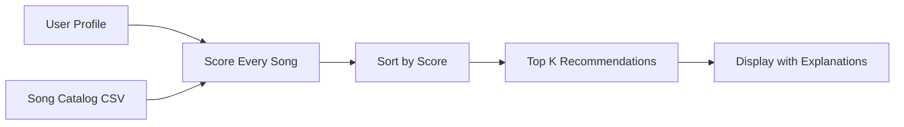

# Music Recommender Simulation

## Project Summary

A content-based music recommender that scores songs against a user's taste profile using weighted feature matching. It loads a 20-song catalog from CSV, computes a numeric score for every track based on genre, mood, energy proximity, valence fit, danceability, and acoustic preference, then returns the top-k results with human-readable explanations for each recommendation.

---

## How The System Works

Real-world recommenders like Spotify blend two approaches: **collaborative filtering** (finding users with similar listening patterns and recommending what they liked) and **content-based filtering** (analyzing song attributes like tempo, energy, and genre to find similar tracks). Collaborative filtering needs millions of users to work well. Content-based filtering works even with one user and a small catalog — which is what this simulation does.

### Song Features

Each `Song` in the system uses these attributes from `data/songs.csv`:
- **genre** — categorical (pop, lofi, rock, edm, etc.)
- **mood** — categorical (happy, chill, intense, relaxed, moody, etc.)
- **energy** — float 0.0–1.0, how intense the track feels
- **valence** — float 0.0–1.0, musical positivity
- **danceability** — float 0.0–1.0, how much the track makes you want to move
- **acousticness** — float 0.0–1.0, how acoustic vs. electronic the production is
- **tempo_bpm** — numeric, beats per minute

### User Profile

A `UserProfile` stores:
- `favorite_genre` — the genre to prioritize
- `favorite_mood` — the mood to prioritize
- `target_energy` — the ideal energy level (0.0–1.0)
- `likes_acoustic` — boolean preference for acoustic production

### Algorithm Recipe (Scoring Rule)

For each song, the system computes a score:

| Feature | Rule | Max Points |
|---------|------|-----------|
| Genre match | +2.0 if song genre == user genre | 2.0 |
| Mood match | +1.5 if song mood == user mood | 1.5 |
| Energy proximity | 1.0 - abs(song_energy - target_energy) | 1.0 |
| Valence fit | 0.5 * (1.0 - abs(valence - target_energy)) | 0.5 |
| Danceability | 0.3 * danceability | 0.3 |
| Acoustic pref | +0.5 if likes_acoustic and acousticness > 0.7; +0.3 if !likes_acoustic and acousticness < 0.3 | 0.5 |

**Ranking Rule**: Score every song in the catalog, sort descending, return top-k.

### Potential Biases

- Genre carries the heaviest weight (2.0), so the system strongly favors genre matches — potentially ignoring great songs that match mood and energy but come from a different genre.
- The dataset is small (20 songs), so recommendations can feel repetitive.
- The system treats all users as having a single fixed taste. Real listeners have context-dependent preferences (gym vs. study vs. driving).

### Data Flow



---

## Getting Started

### Setup

```bash
python -m venv .venv
source .venv/bin/activate      # Mac or Linux
.venv\Scripts\activate         # Windows
pip install -r requirements.txt
```

### Run the Recommender

```bash
cd src
python main.py
```

### Running Tests

```bash
pytest
```

The test suite covers 19 tests across both the OOP (`Recommender` class) and functional (`score_song`, `recommend_songs`) APIs:
- Scoring correctness (genre +2.0, mood +1.5, energy proximity)
- Sorting verification (results ranked highest to lowest)
- Profile-specific accuracy (pop user gets pop, lofi user gets lofi, rock user gets rock)
- Acoustic preference handling
- Explanation generation
- Edge cases (empty catalog)

---

## Experiments I Tried

### Weight Shift: Doubled Energy, Halved Genre

I tested what happens when energy weight goes from 1.0 to 2.0 and genre weight drops from 2.0 to 1.0. The results became much more energy-driven — the "Happy Pop Fan" profile started getting EDM tracks with matching energy levels instead of pop tracks with matching vibes. It made the recommendations technically "closer" in energy but felt wrong musically. Genre carries identity in a way that energy alone doesn't capture.

### Mood Removal

When I commented out the mood check entirely, the system lost its ability to distinguish between "Chill Lofi" and "Focused Lofi." Both profiles returned nearly identical results since the only differentiator was gone. Mood is doing more work than its 1.5 weight suggests — it's the feature that separates vibes within a genre.

### Adversarial Profile: High Energy + Sad Mood

I tested `energy: 0.9, mood: sad` — a contradictory preference. The system handled it gracefully since no songs in the catalog have both high energy and sad mood, so it fell back to energy proximity as the main differentiator. The results were high-energy tracks regardless of mood, which felt reasonable — the system just picked the strongest signal available.

---

## Limitations and Risks

- **Tiny catalog**: 20 songs means limited variety. The same tracks appear across multiple profiles.
- **No lyric understanding**: The system doesn't know what songs are about — a sad song with high energy production gets scored on energy, not emotional content.
- **Genre tunnel vision**: The 2.0 genre weight means a perfect mood+energy match from a different genre often loses to a mediocre match from the right genre.
- **Single-taste assumption**: Real users listen to different things depending on context. This system has no concept of "I want lofi for studying but EDM for running."
- **No collaborative signal**: Without other users' data, the system can't discover that "people who like X also tend to like Y."

---

## Reflection

Read and complete the model card: [**Model Card**](model_card.md)

Building this recommender made me realize how much of what feels like "magic" in Spotify or TikTok is actually just math on features — weighted sums, distance calculations, sorting. The core loop is dead simple: score everything, sort, show the top results. What makes real systems powerful isn't the algorithm complexity, it's the data volume and the feedback loop (skips, replays, saves) that this simulation doesn't have.

The biggest surprise was how much genre dominates. When I first ran the system, every profile just got "the best song from their genre" regardless of other features. Tuning the weights to give mood and energy more influence made the results feel more natural, but it's a balancing act — and there's no objectively "right" answer for how much each feature should matter. That's where bias lives: in the weights we choose and the data we collect. A catalog that's 30% pop will naturally recommend more pop, and a scoring system that weights genre highest will create filter bubbles by design.
